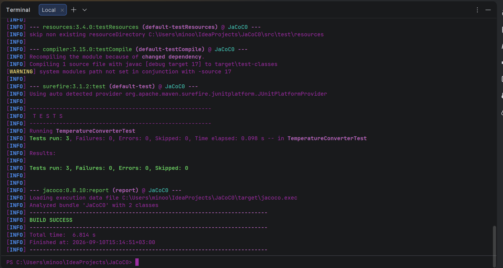

# Temperature Converter - Code Coverage Assignment

This project is part of my in-class assignment about unit testing and code coverage in Java.

The main goal was to create a simple temperature converter, write tests for it using JUnit 5, and then use JaCoCo to check the code coverage.

## What I implemented

The `TemperatureConverter` class has three methods:

- `fahrenheitToCelsius()` converts Fahrenheit to Celsius.
- `celsiusToFahrenheit()` converts Celsius to Fahrenheit.
- `isExtremeTemperature()` checks if a Celsius temperature is below -40°C or above 50°C.

## Testing

I created `TemperatureConverterTest` using JUnit 5.

I tested the conversion methods with different values, for example:

- 32°F = 0°C
- 212°F = 100°C
- 0°C = 32°F
- 100°C = 212°F

I also tested the extreme temperature method around the boundary values such as -40°C and 50°C.

This helped me understand why edge cases are important when writing unit tests.

## Code Coverage

I used JaCoCo with Maven to generate the code coverage report.

I ran the tests using:

```bash
mvn clean test
```

The JaCoCo HTML report is generated in:

```text
target/site/jacoco/index.html
```

The report shows line coverage, branch coverage, method coverage, and class coverage.

## Test Result

Here is the screenshot of my test results:



## What I learned

From this assignment, I learned how to write unit tests with JUnit 5 and how to use `assertEquals`, `assertTrue`, and `assertFalse`.

I also learned why testing boundary values is important. For example, -40°C and 50°C are not extreme temperatures in my program, but values below -40°C or above 50°C are.

I also learned how to use JaCoCo with Maven to check which parts of my code are covered by my tests.