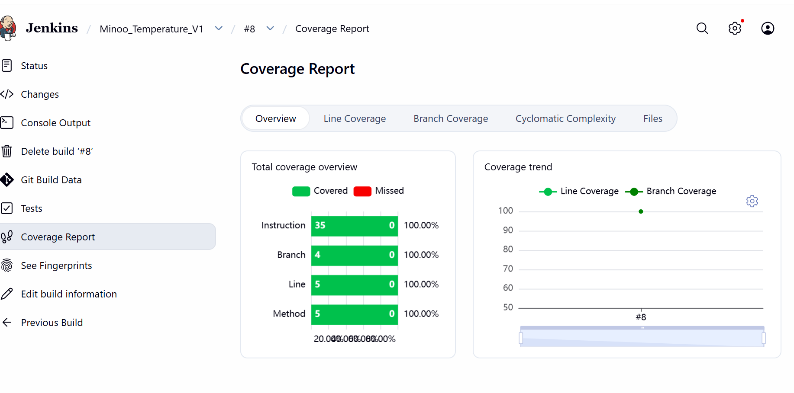
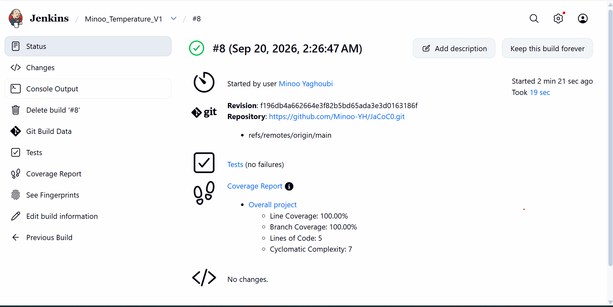

# Temperature Converter - Code Coverage Assignment

This project is part of my in-class assignment about unit testing and code coverage in Java.

The goal was to create a simple temperature converter, write unit tests using JUnit 5, check the code coverage with JaCoCo, and run the project in Jenkins.

## What I implemented

The `TemperatureConverter` class has four methods:

- `fahrenheitToCelsius()` converts Fahrenheit to Celsius.
- `celsiusToFahrenheit()` converts Celsius to Fahrenheit.
- `kelvinToCelsius()` converts Kelvin to Celsius.
- `isExtremeTemperature()` checks if a Celsius temperature is below -40°C or above 50°C.

For Kelvin to Celsius, I used:

C = K - 273.15

For example, 300 K is 26.85°C.

## Testing

I used JUnit 5 to test the temperature conversion methods and the extreme temperature check.

All 4 tests passed successfully.

## Code Coverage

I used JaCoCo to check the code coverage.

The final coverage report shows 100% coverage for instructions, branches, lines, and methods.



## Jenkins

I created a Jenkins Freestyle project called `Minoo_Temperature_V1`.

Jenkins gets the project from GitHub and runs the Maven tests with:

`clean verify`

The Jenkins build and tests completed successfully.



I created `TemperatureConverterTest` using JUnit 5.

I tested the conversion methods with different values, for example:

- 32°F = 0°C
- 212°F = 100°C
- 0°C = 32°F
- 100°C = 212°F

I also tested the extreme temperature method around the boundary values such as -40°C and 50°C.

This helped me understand why edge cases are important when writing unit tests.

## Code Coverage

I used JaCoCo with Maven to generate the code coverage report.

I ran the tests using:

```bash
mvn clean test
```

The JaCoCo HTML report is generated in:

```text
target/site/jacoco/index.html
```

The report shows line coverage, branch coverage, method coverage, and class coverage.

## Test Result

Here is the screenshot of my test results:


## What I learned

From this assignment, I learned how to write unit tests with JUnit 5 and how to use `assertEquals`, `assertTrue`, and `assertFalse`.

I also learned why testing boundary values is important. For example, -40°C and 50°C are not extreme temperatures in my program, but values below -40°C or above 50°C are.

I also learned how to use JaCoCo with Maven to check which parts of my code are covered by my tests.