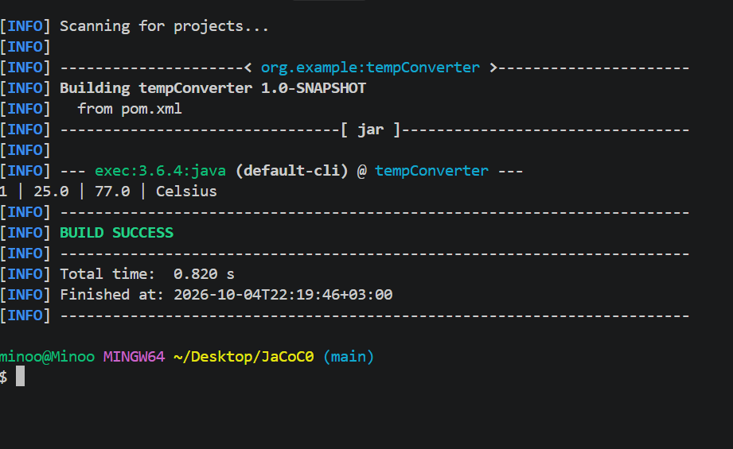
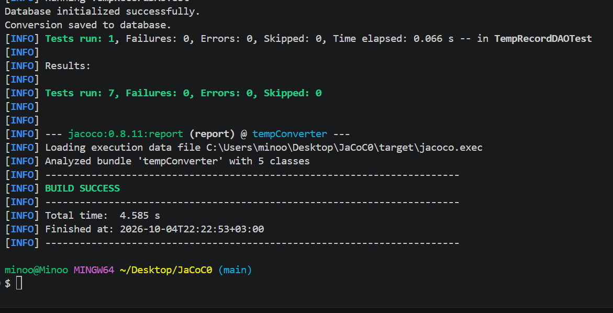
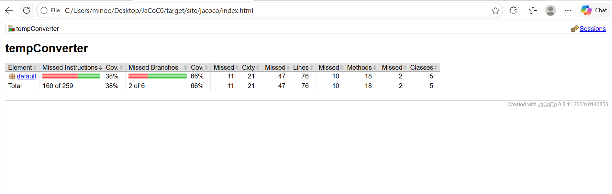
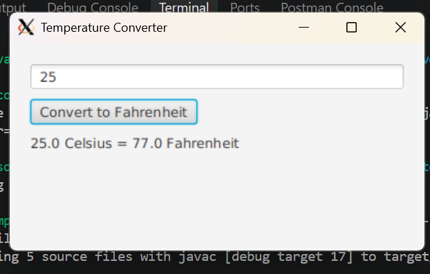

# Temperature Converter

A Java temperature converter that I built and extended over several course assignments. It has a JavaFX GUI, saves every conversion in an SQLite database, is tested with JUnit 5, is measured with JaCoCo, is built in Jenkins and GitHub Actions, and runs in Docker.

**Required assignment sections**

| Required section | Section in this README |
|---|---|
| 1. Assignment Description | [Assignment Description](#assignment-description) |
| 2. Technologies & Tools Used | [Technologies & Tools Used](#technologies--tools-used) |
| 3. Design Approach & Implementation Method | [Design Approach & Implementation Method](#design-approach--implementation-method) |
| 4. Testing & Quality Assurance Steps | [Testing & Quality Assurance](#testing--quality-assurance) |
| 5. How to Run | [How to Run](#how-to-run) |

Other sections: [Features](#features) · [Docker](#docker) · [Jenkins / CI/CD](#jenkins--cicd) · [GitHub Actions](#github-actions) · [Project Structure](#project-structure) · [Screenshots / Evidence](#screenshots--evidence) · [Known Limitations](#known-limitations) · [Conclusion](#conclusion)

---

## Assignment Description

### Problem Statement

The task was to build a small temperature converter in Java and use it to practise software quality work: unit testing, code coverage, continuous integration and containers. In Assignment 6 the console program had to become a GUI application with a database, and the new code also had to be tested and run from Docker.

### Key Requirements

- Implement temperature conversion logic in Java (Celsius, Fahrenheit and Kelvin) and an extreme-temperature check.
- Write unit tests with JUnit 5, including boundary values.
- Measure code coverage with JaCoCo.
- Build and test the project in Jenkins, first as a Freestyle project and then as a Pipeline defined in a `Jenkinsfile`.
- Build a Docker image and push it to Docker Hub.
- Assignment 6: create a JavaFX GUI, store the conversions in an SQLite database with two related tables, add unit tests for the database code, and run the GUI from Docker with an X server (Xming).
- Document the implementation, the testing steps and how to run the project in this README.

### Deliverables

| Deliverable | File / location |
|---|---|
| Conversion logic | `src/main/java/TemperatureConverter.java` |
| JavaFX GUI | `src/main/java/TemperatureApp.java` |
| Database connection and setup | `src/main/java/DBConnection.java` |
| Data access (saving records) | `src/main/java/TempRecordDAO.java` |
| Tool for checking saved records | `src/main/java/CheckDatabase.java` |
| Unit tests (7 tests) | `src/test/java/` |
| Maven build with JavaFX, SQLite, JUnit and JaCoCo | `pom.xml` |
| Jenkins Pipeline | `Jenkinsfile` |
| GitHub Actions workflows | `.github/workflows/` |
| Docker image definition | `Dockerfile` |
| Docker image | `minooyh/tempconverter:latest` on Docker Hub |
| Documentation and screenshots | `README.md` and the `.png` files in the repository root |

### Assignment Parts

#### Temperature Converter - Code Coverage Assignment

This project is part of my in-class assignment about unit testing and code coverage in Java.

The goal was to create a simple temperature converter, write unit tests using JUnit 5, check the code coverage with JaCoCo, and run the project in Jenkins.

#### Assignment 6 - JavaFX, Database and Docker

For this assignment, I continued working on my Temperature Converter project. I changed the console project into a JavaFX application and added an SQLite database. I also added more unit tests and ran the JavaFX application from Docker using Xming.

## Features

| Feature | Implemented in | Available in the GUI? |
|---|---|---|
| Celsius to Fahrenheit | `TemperatureConverter.celsiusToFahrenheit()` | Yes, this is the only conversion in the GUI |
| Fahrenheit to Celsius | `TemperatureConverter.fahrenheitToCelsius()` | No (code and unit tests only) |
| Kelvin to Celsius | `TemperatureConverter.kelvinToCelsius()` | No (code and unit tests only) |
| Extreme temperature check (below -40°C or above 50°C) | `TemperatureConverter.isExtremeTemperature()` | No (code and unit tests only) |
| Input validation (text that is not a number) | `TemperatureApp` | Yes |
| Saving every GUI conversion in SQLite | `TempRecordDAO.saveRecord()` | Yes, automatic |
| Creating the database tables at start-up | `DBConnection.initializeDatabase()`, called from `TemperatureApp.start()` | Yes, automatic |
| Listing all saved records | `CheckDatabase` | No, command-line tool |
| Console demo that prints `100 Celsius = 212.0 Fahrenheit` | `TemperatureConverter.main()` | No, used by the JAR |

## Technologies & Tools Used

The versions below come from `pom.xml`, `Dockerfile`, `Jenkinsfile` and the workflow files in `.github/workflows/`.

| Category | Technology / tool | Version | Used for |
|---|---|---|---|
| Language | Java | 17 (`maven.compiler.source` and `target`) | All application and test code |
| Build tool | Apache Maven | 3.9.15 | Building, testing, coverage and running the app |
| GUI framework | JavaFX (`org.openjfx:javafx-controls`) | 17.0.16 | The GUI window |
| Maven plugin | `javafx-maven-plugin` | 0.0.8 | `mvn javafx:run` (main class `TemperatureApp`) |
| Database | SQLite with the `org.xerial:sqlite-jdbc` driver | 3.50.3.0 | The database file `temperature.db` |
| Database access | JDBC (`java.sql`) | Part of Java | Connections, SQL statements and prepared statements |
| Unit testing | JUnit 5 (`junit-jupiter-api` and `junit-jupiter-engine`) | 5.10.0 | Unit tests |
| Test runner | Maven Surefire Plugin | 3.1.2 | Runs every `*Test.java` class |
| Code coverage | JaCoCo Maven Plugin | 0.8.11 | Coverage report in `target/site/jacoco/` |
| Packaging | Maven JAR Plugin | 3.4.2 | JAR with the main class `TemperatureConverter` |
| Helper plugin | Exec Maven Plugin (`exec:java`) | 3.6.4 (not declared in `pom.xml`; Maven downloads it when the command is used) | Running `DBConnection` and `CheckDatabase` |
| CI/CD | Jenkins (Freestyle project and Pipeline) | Maven tool `Maven-3.9.15` | Build, tests, coverage, Docker build and push |
| CI | GitHub Actions (`actions/checkout@v4`, `actions/setup-java@v4`) | Temurin JDK 17 | Maven build on every push and pull request |
| Containers | Docker, base image `eclipse-temurin:17-jdk` | - | Running the JavaFX app in a container |
| Image registry | Docker Hub (`minooyh/tempconverter`) | Tag `latest` | Sharing the image |
| X server | Xming | - | Showing the JavaFX window from Docker on Windows |
| IDEs | IntelliJ IDEA and VS Code | - | Development (both are visible in the screenshots) |
| Operating systems | Windows 11 (development and Jenkins), Linux (GitHub Actions runner and Docker image) | - | Building and running |
| Version control | Git and GitHub | - | Source code repository |

## Design Approach & Implementation Method

### Application Architecture

I kept the conversion logic, the GUI and the database code in separate classes. The logic class does not depend on JavaFX or the database, so it can be tested on its own. All classes are in the default package in `src/main/java`.

| Class | Layer | Responsibility |
|---|---|---|
| `TemperatureConverter` | Logic | Conversion formulas and the extreme-temperature check. Its `main` method prints one example conversion. |
| `TemperatureApp` | GUI (JavaFX) | Builds the window, reads the input, shows the result and saves each conversion. |
| `DBConnection` | Database | Opens SQLite connections, turns on foreign keys, and creates the tables and units. |
| `TempRecordDAO` | Data access | Saves one conversion record with a prepared statement. |
| `CheckDatabase` | Tool | Prints all saved records with their unit name. |

```text
User
 └─ TemperatureApp (JavaFX window)
      ├─ on start: DBConnection.initializeDatabase()          creates tables and units
      ├─ on click: TemperatureConverter.celsiusToFahrenheit()  converts the value
      └─ on click: TempRecordDAO.saveRecord() ──> DBConnection.connect() ──> temperature.db

CheckDatabase ──> DBConnection.connect() ──> temperature.db   (reads and prints records)
```

### Temperature Conversion Logic

#### What I implemented

The `TemperatureConverter` class has four methods:

- `fahrenheitToCelsius()` converts Fahrenheit to Celsius.
- `celsiusToFahrenheit()` converts Celsius to Fahrenheit.
- `kelvinToCelsius()` converts Kelvin to Celsius.
- `isExtremeTemperature()` checks if a Celsius temperature is below -40°C or above 50°C.

For Kelvin to Celsius, I used:

C = K - 273.15

For example, 300 K is 26.85°C.

The class also has a `main` method, which I added later for the console JAR and the first Docker image.

| Method | Formula / rule | Example |
|---|---|---|
| `fahrenheitToCelsius(double)` | `(F - 32) * 5 / 9` | 212°F = 100°C |
| `celsiusToFahrenheit(double)` | `(C * 9 / 5) + 32` | 25°C = 77°F |
| `kelvinToCelsius(double)` | `K - 273.15` | 300 K = 26.85°C |
| `isExtremeTemperature(double)` | `celsius < -40 \|\| celsius > 50` | -41 is extreme, -40 and 50 are not, 51 is extreme |

All methods take and return `double` values and do not change any state, so they are simple to test.

### JavaFX GUI

#### JavaFX Temperature Converter

I created a simple JavaFX interface for the Temperature Converter. The user can enter a Celsius value, click the convert button, and see the result in Fahrenheit.

For example, I tested 25 Celsius and the result was 77 Fahrenheit.

How the GUI works (from `TemperatureApp.java`):

- The window title is "Temperature Converter" and the window size is 400 x 200 pixels.
- A `VBox` layout (10 px spacing, 20 px padding) contains three controls, from top to bottom:
  - a `TextField` with the hint text "Enter Celsius"
  - a `Button` with the text "Convert to Fahrenheit"
  - a `Label` that first shows "Result:"
- When the window starts, `start()` calls `DBConnection.initializeDatabase()`, so the tables exist before the first conversion is saved.
- When the button is clicked, the app:
  1. reads the text and converts it with `Double.parseDouble()`
  2. calculates the result with `TemperatureConverter.celsiusToFahrenheit()`
  3. saves the input and the result with `TempRecordDAO.saveRecord()`
  4. shows the result, for example `25.0 Celsius = 77.0 Fahrenheit`
- **Input validation:** if the text is not a number (for example `abc` or an empty field), `Double.parseDouble()` throws a `NumberFormatException`. The app catches it and shows `Please enter a valid number.`. Nothing is saved in that case.

The GUI only converts Celsius to Fahrenheit. The other methods of `TemperatureConverter` are not connected to the GUI. A screenshot of the window is in the [Docker](#docker) section (`XmingConvertor.png`).

### Database Design

#### Database

I used SQLite for the database and created two related tables:

- `temperature_unit`
- `temperature_record`

The tables are connected with a foreign key. I used `DBConnection` for the database connection and initialization, and `TempRecordDAO` to save the conversion records.

When I make a conversion in the JavaFX application, the conversion can be saved in the database.



The screenshot shows the output of `CheckDatabase` after one conversion in the GUI: record 1 with the input 25.0, the result 77.0 and the unit Celsius.

The database is one SQLite file called `temperature.db`. The JDBC URL is `jdbc:sqlite:temperature.db`, so the file is created in the folder where the program is started (the project folder when Maven is used). SQLite creates the file automatically if it does not exist.

**Table `temperature_unit`** (the units):

| Column | Type | Constraints |
|---|---|---|
| `id` | INTEGER | PRIMARY KEY AUTOINCREMENT |
| `name` | TEXT | NOT NULL, UNIQUE |
| `symbol` | TEXT | NOT NULL |

Initial rows: `Celsius` / `C`, `Fahrenheit` / `F` and `Kelvin` / `K`.

**Table `temperature_record`** (one row per conversion):

| Column | Type | Constraints |
|---|---|---|
| `id` | INTEGER | PRIMARY KEY AUTOINCREMENT |
| `input_value` | REAL | NOT NULL |
| `result_value` | REAL | NOT NULL |
| `unit_id` | INTEGER | NOT NULL, FOREIGN KEY to `temperature_unit(id)` |
| `created_at` | TEXT | DEFAULT CURRENT_TIMESTAMP |

**Relationship:** one-to-many. One unit can have many records, and each record points to exactly one unit through `unit_id`.

```text
temperature_unit (1) ──────< (many) temperature_record
       id  <──────────────────────  unit_id
```

### Data Persistence

- **Initialization:** `DBConnection.initializeDatabase()` runs `CREATE TABLE IF NOT EXISTS` for both tables and `INSERT OR IGNORE` for the three units. It is safe to run many times: existing tables and records are kept and the units are not added twice. It is called when the JavaFX app starts, by `DBConnection.main()`, and by the database tests.
- **Foreign keys:** SQLite does not check foreign keys by default, so `DBConnection.connect()` runs `PRAGMA foreign_keys = ON` on every new connection.
- **Saving a record:** `TempRecordDAO.saveRecord(inputValue, resultValue)` uses a `PreparedStatement`:

  ```sql
  INSERT INTO temperature_record (input_value, result_value, unit_id)
  SELECT ?, ?, id
  FROM temperature_unit
  WHERE name = 'Celsius'
  ```

  The two values are passed as `?` parameters and are not joined into the SQL text. The `INSERT ... SELECT` looks up the id of the `Celsius` unit, so the id is not hard-coded. The saved unit is the unit of the input value (Celsius). SQLite fills in `created_at` automatically.
- **Reading records:** `CheckDatabase` joins the two tables and prints every record ordered by `id` in the format `id | input_value | result_value | unit name`.
- **Resources and errors:** connections, statements and result sets are opened in try-with-resources blocks, so they are closed automatically. In `DBConnection` and `TempRecordDAO`, an `SQLException` is caught and printed to the console (`Database error: ...` or `Could not save record: ...`).

### Key Implementation Decisions

| Decision | Reason |
|---|---|
| SQLite instead of a database server | The database is a single file and needs no server or setup, so the project is easy to run on my computer, in Jenkins and in Docker. |
| Logic separated from the GUI and the database | `TemperatureConverter` can be unit tested without starting JavaFX or opening a database. |
| A DAO class for saving | The GUI contains no SQL, and the database code stays in one place. |
| `PreparedStatement` with parameters | The values are sent separately from the SQL text, which is safer than building SQL strings. |
| `IF NOT EXISTS` and `INSERT OR IGNORE` | The initialization can run every time the app starts without errors or duplicate units. |
| `PRAGMA foreign_keys = ON` | SQLite really enforces the relationship between the two tables. |
| Database initialization when the app starts | The tables are created automatically on a new computer or in a new Docker container. |
| Catching `NumberFormatException` in the GUI | Wrong input shows a message instead of crashing the app. |
| `javafx-maven-plugin` to start the GUI | Maven provides the JavaFX libraries, so the app starts with `mvn javafx:run` without manual JavaFX setup. |
| Docker image that runs `mvn javafx:run` | The same command works locally and in the container. The X11/GTK libraries in the image let JavaFX draw the window through Xming. |

## Testing & Quality Assurance

I used three kinds of checks: automated unit tests with JUnit 5, code coverage with JaCoCo, and manual checks of the GUI, the database, Docker and Jenkins. The automated tests also run in Jenkins and in GitHub Actions.

### Automated Tests

#### Testing

I used JUnit 5 to test the temperature conversion methods and the extreme temperature check.

All 4 tests passed successfully.

I created `TemperatureConverterTest` using JUnit 5.

I tested the conversion methods with different values, for example:

- 32°F = 0°C
- 212°F = 100°C
- 0°C = 32°F
- 100°C = 212°F

I also tested the extreme temperature method around the boundary values such as -40°C and 50°C.

This helped me understand why edge cases are important when writing unit tests.

How the automated tests are set up:

- The tests are in `src/test/java` and use JUnit 5 assertions: `assertEquals` (with a tolerance of 0.001 for decimal values), `assertTrue`, `assertFalse`, `assertNotNull` and `assertDoesNotThrow`.
- Maven Surefire 3.1.2 runs every class that matches `**/*Test.java`.
- The JaCoCo agent is attached before the tests (`prepare-agent`), and the JaCoCo report is created in the `test` phase, so `mvn test` produces both the test results and the coverage report.
- The database tests use the real `temperature.db` file in the project folder.

### Test Cases & Results

Results of `mvn clean test`, run again on 6 October 2026 with the current code:

| # | Test class | Test method | What is tested | Inputs and expected results | Result |
|---|---|---|---|---|---|
| 1 | `TemperatureConverterTest` | `testFahrenheitToCelsius` | Fahrenheit to Celsius formula | 32 → 0, 212 → 100, -40 → -40 | Passed |
| 2 | `TemperatureConverterTest` | `testCelsiusToFahrenheit` | Celsius to Fahrenheit formula | 0 → 32, 100 → 212 | Passed |
| 3 | `TemperatureConverterTest` | `testIsExtremeTemperature` | Extreme check, including both limits | -50 and -41 → true; -40 and 50 → false; 51 → true | Passed |
| 4 | `TemperatureConverterTest` | `testKelvinToCelsius` | Kelvin to Celsius formula | 273.15 → 0, 300 → 26.85, 0 → -273.15 | Passed |
| 5 | `DBConnectionTest` | `testDatabaseConnection` | A database connection can be opened | `connect()` returns a connection that is not null and not closed | Passed |
| 6 | `DBConnectionTest` | `testInitializeDatabase` | The database setup runs without problems | `initializeDatabase()` does not throw an exception | Passed |
| 7 | `TempRecordDAOTest` | `testSaveRecord` | A record is really written to the database | Saves 10.0°C / 50.0°F, reads it back with SQL and compares both values | Passed |

| Test class | Tests | Failures | Errors | Skipped |
|---|---|---|---|---|
| `TemperatureConverterTest` | 4 | 0 | 0 | 0 |
| `DBConnectionTest` | 2 | 0 | 0 | 0 |
| `TempRecordDAOTest` | 1 | 0 | 0 | 0 |
| **Total** | **7** | **0** | **0** | **0** |

What each test class covers:

- **`TemperatureConverterTest`** checks every conversion formula with normal values and special values (-40 is the same in both scales, and 0 K is absolute zero). It also checks the extreme-temperature rule just inside and just outside both limits.
- **`DBConnectionTest`** checks that the SQLite driver works and that a connection opens, and that the table creation runs. `initializeDatabase()` catches `SQLException` itself, so this test shows that no unexpected exception escapes. `TempRecordDAOTest` shows that the tables really exist.
- **`TempRecordDAOTest`** is an integration test with the real database. It creates the tables, saves a record with the DAO, and then reads the record back with a separate SQL query.

The detailed reports are in `target/surefire-reports/` (one `.txt` and one `.xml` file per test class).

#### Unit Tests

I kept my previous unit tests and added new tests for the database classes:

- `DBConnectionTest`
- `TempRecordDAOTest`

The project now has 7 tests in total and all 7 tests pass.



#### Test Result

Here is the screenshot of my test results:


Note: This screenshot is from an early run on 10 September 2026, when `TemperatureConverterTest` had 3 tests. The Kelvin test was added later, which made 4 tests. The current result with all 7 tests is in the screenshot above.

### Code Coverage

#### Code Coverage

I used JaCoCo with Maven to generate the code coverage report.

I ran the tests using:

```bash
mvn clean test
```

The JaCoCo HTML report is generated in:

```text
target/site/jacoco/index.html
```

The report shows line coverage, branch coverage, method coverage, and class coverage.


Note: This screenshot is the coverage report in Jenkins (Freestyle project `Minoo_Temperature_V1`, build #8). At that time the project only had the four conversion methods, and the coverage was 100% for instructions (35 of 35), branches (4 of 4), lines (5 of 5) and methods (5 of 5).

#### JaCoCo Code Coverage

I used JaCoCo again after adding the new JavaFX and database classes.

The latest report shows 38% instruction coverage and 66% branch coverage.



**Current coverage (6 October 2026).** After the database initialization call was added to `TemperatureApp`, the coverage is still 38% of instructions and 66% of branches. The screenshot above was taken just before that change, when the project had 259 instructions instead of 260.

| Counter | Covered | Total | Coverage |
|---|---|---|---|
| Instructions | 99 | 260 | 38% |
| Branches | 4 | 6 | 66% |
| Lines | 29 | 77 | 37% |
| Methods | 8 | 18 | 44% |
| Classes | 3 | 5 | 60% |

The percentages are rounded down, like in the JaCoCo report.

| Class | Instructions covered | Branches covered | Lines covered | Not covered |
|---|---|---|---|---|
| `TemperatureConverter` | 35 of 48 (72%) | 4 of 4 (100%) | 5 of 9 | Only `main` (the console demo) |
| `DBConnection` | 40 of 51 (78%) | No branches | 15 of 20 | `main`, the `catch (SQLException)` block and the default constructor |
| `TempRecordDAO` | 24 of 33 (72%) | No branches | 9 of 12 | The `catch (SQLException)` block and the default constructor |
| `TemperatureApp` | 0 of 96 (0%) | No branches | 0 of 25 | The whole class (JavaFX GUI) |
| `CheckDatabase` | 0 of 32 (0%) | 0 of 2 | 0 of 11 | The whole class (command-line tool) |

Why the total coverage is 38%:

- The conversion logic, which is the core of the program, is fully tested. Every formula method is covered, and all 4 branches of `isExtremeTemperature()` are covered.
- `TemperatureApp` is the largest class (96 instructions) and has no automated tests. Testing a JavaFX window needs a running JavaFX toolkit and extra test tools, so I checked the GUI manually instead (see [Manual Verification](#manual-verification)).
- `CheckDatabase` and the `main` methods are small command-line entry points that I run by hand, not from the tests.
- The `catch (SQLException)` blocks only run when the database fails, and no test simulates a database error.
- The default constructors are added by Java automatically. They are never called because all database methods are static.

### Manual Verification

| # | Scenario | Steps | Expected result | Actual result | Evidence |
|---|---|---|---|---|---|
| 1 | Valid Celsius input in the GUI | Start the app, type `25`, click **Convert to Fahrenheit** | `25.0 Celsius = 77.0 Fahrenheit` | As expected | [XmingConvertor.png](XmingConvertor.png) |
| 2 | Conversion saved in the database | After test 1, run `CheckDatabase` | A record with 25.0, 77.0 and Celsius | `1 \| 25.0 \| 77.0 \| Celsius` | [DatabaseConect.png](DatabaseConect.png) |
| 3 | Invalid input in the GUI | Type `abc`, click the button | `Please enter a valid number.` and no new record | As expected | Checked on 6 October 2026 (no screenshot) |
| 4 | Database created at start-up | Run `mvn javafx:run` in a folder without `temperature.db` | `Database initialized successfully.`, a new `temperature.db` and the window opens | As expected | Checked on 6 October 2026 (no screenshot) |
| 5 | JavaFX app in Docker with Xming | Start Xming, run the container with `DISPLAY=host.docker.internal:0.0`, convert 25 | The window opens through Xming and shows 77 Fahrenheit | As expected | [XmingConvertor.png](XmingConvertor.png) |
| 6 | First (console) Docker image | `docker pull` and `docker run --rm minooyh/tempconverter:latest` | `100 Celsius = 212.0 Fahrenheit` | As expected | [image.png](image.png) |
| 7 | Image on Docker Hub | Push the image and open Docker Hub | Tag `latest` in `minooyh/tempconverter` | As expected | [dockerhublatest.png](dockerhublatest.png) |
| 8 | Jenkins Freestyle build | Build `Minoo_Temperature_V1` with `clean verify` | The build passes with no test failures | Build #8 passed, no test failures | [Jenkin_test_result.png](Jenkin_test_result.png) |
| 9 | Jenkins Pipeline | Run `Minoo_Temperature_Pipeline` | All stages pass, including Docker Build and Docker Push | Build #15 passed all stages | [4.png](4.png) |
| 10 | JaCoCo report | Run `mvn clean test` and open `target/site/jacoco/index.html` | A report with coverage per class | 38% instructions, 66% branches | [coverage_new.png](coverage_new.png) |

## How to Run

I checked all commands in this section on 6 October 2026 in a fresh copy of the project (Windows 11, Git Bash and PowerShell, OpenJDK 21, Maven 3.9.15).

### Prerequisites

| Software | Needed for | Notes |
|---|---|---|
| JDK 17 or newer | Everything | The code is compiled for Java 17. I used OpenJDK 21. |
| Apache Maven 3.9 or newer | Building, testing and running | I used Maven 3.9.15. The first build downloads the libraries, so internet access is needed. |
| Git | Cloning the repository | |
| Docker Desktop | The Docker steps only | |
| Xming | Showing the GUI from Docker on Windows only | An X server for Windows |

JavaFX, SQLite and JUnit do not have to be installed separately. Maven downloads them.

### Clone / Open Project

```bash
git clone https://github.com/Minoo-YH/JaCoC0.git
cd JaCoC0
```

The folder can also be opened in IntelliJ IDEA or VS Code as a Maven project. Run all the commands below from the project folder (the folder with `pom.xml`).

### Build

```bash
mvn clean compile
```

Deletes the old `target` folder and compiles the five classes in `src/main/java` into `target/classes`.

### Initialize Database

```bash
mvn compile exec:java "-Dexec.mainClass=DBConnection"
```

Runs `DBConnection.main()`, which creates `temperature.db` in the project folder with the two tables and the three units, and prints `Database initialized successfully.`. It is safe to run more than once. Existing records are kept.

This step is optional, because the JavaFX app and the database tests also create the tables. In a fresh copy of the project, though, one of them must run before `CheckDatabase`. Otherwise `CheckDatabase` fails with `no such table: temperature_record`.

> Keep the quotes around the whole `-Dexec.mainClass=...` argument. In PowerShell, `-Dexec.mainClass="DBConnection"` (with the quotes only around the class name) is split into two arguments and Maven fails. The form shown above works in both PowerShell and Git Bash.

### Run JavaFX Application

```bash
mvn javafx:run
```

Compiles the code and starts `TemperatureApp` with the JavaFX Maven plugin. The app creates the database tables if needed and opens the "Temperature Converter" window. Type a Celsius value and click **Convert to Fahrenheit**. The result is shown in the window and saved in `temperature.db`. Close the window to stop the program.

### Run Tests

```bash
mvn test
```

or, to start from a clean build:

```bash
mvn clean test
```

Runs the 7 JUnit tests. The output should end with `Tests run: 7, Failures: 0, Errors: 0, Skipped: 0` and `BUILD SUCCESS`. The reports are saved in `target/surefire-reports/`.

Note: `TempRecordDAOTest` saves a test record (10.0°C / 50.0°F) in `temperature.db` every time the tests run.

### Generate Coverage Report

The JaCoCo report is created automatically by `mvn test` and `mvn clean test`. Open this file in a browser:

```text
target/site/jacoco/index.html
```

To create the report again from the last test run without running the tests again:

```bash
mvn jacoco:report
```

### Check Database Records

```bash
mvn compile exec:java "-Dexec.mainClass=CheckDatabase"
```

Prints every saved conversion in the format `id | input value | result value | unit`, for example:

```text
1 | 25.0 | 77.0 | Celsius
```

### Run Packaged JAR

```bash
mvn clean package
java -jar target/tempConverter-1.0-SNAPSHOT.jar
```

`mvn clean package` runs the tests and builds the JAR. The main class of the JAR is `TemperatureConverter`, so the JAR runs the console version and prints:

```text
100 Celsius = 212.0 Fahrenheit
```

The JAR does not start the GUI: its main class is the console class, and the JavaFX and SQLite libraries are not packaged inside it. Use `mvn javafx:run` for the GUI.

## Docker

### Current Dockerfile

The current `Dockerfile` runs the JavaFX version of the app:

| Step | Instruction | What it does |
|---|---|---|
| 1 | `FROM eclipse-temurin:17-jdk` | Starts from an image with JDK 17 |
| 2 | `RUN apt-get update && apt-get install -y maven libgtk-3-0 libx11-6 libxext6 libxrender1 libxtst6 libxi6 libgl1 ...` | Installs Maven and the GTK, X11 and OpenGL libraries that JavaFX needs to draw a window, then deletes the package lists to keep the image smaller |
| 3 | `WORKDIR /app` | Uses `/app` as the working folder |
| 4 | `COPY pom.xml .` and `RUN mvn dependency:go-offline` | Downloads the Maven dependencies in a separate layer, so they are cached when only the source code changes |
| 5 | `COPY src ./src` | Copies the source code |
| 6 | `CMD ["mvn", "javafx:run"]` | Compiles and starts the JavaFX app when the container starts |

Because the app is a GUI, the container needs an X server on the host computer. On Windows I used Xming, and the container connects to it with `DISPLAY=host.docker.internal:0.0`.

The first Dockerfile (commit `8b73d8a`, used in the Jenkins Pipeline assignment) was different. It used `eclipse-temurin:17-jdk-alpine`, copied the built JAR into the image and ran `java -jar app.jar`, which printed `100 Celsius = 212.0 Fahrenheit`.

### Run with Docker and Xming (Windows)

1. Start Docker Desktop.
2. Start Xming. If the window does not appear in step 4, start Xming again with **No Access Control** selected in XLaunch, so that it accepts the connection from the container.
3. Build the image in the project folder, or pull it from Docker Hub:

   ```bash
   docker build -t minooyh/tempconverter:latest .
   # or
   docker pull minooyh/tempconverter:latest
   ```

4. Run the container:

   ```bash
   docker run --rm -e DISPLAY=host.docker.internal:0.0 minooyh/tempconverter:latest
   ```

5. The "Temperature Converter" window opens through Xming. Close the window to stop the container.

Notes:

- The image on Docker Hub was last pushed on 4 October 2026, before the database initialization call was added to `TemperatureApp`. To put the current code in the image, build it again with `docker build` (step 3) and push it with `docker push minooyh/tempconverter:latest`.
- Inside the container the database file is `/app/temperature.db`. Because of `--rm`, it is deleted when the container stops.
- I could not test Docker again on 6 October 2026 because Docker Desktop was not running. The Docker results below come from the screenshots.

### Docker Results: First Version (Console Image)

#### Docker

I created a Dockerfile for the project and built a Docker image.

The Docker image is:

```text
minooyh/tempconverter:latest
```

The image was also pushed to Docker Hub from the Jenkins pipeline.


Note: The screenshot shows the Docker Hub repository `minooyh/tempconverter` with the tag `latest`, after the Jenkins Pipeline pushed the first image.

#### Running the Docker Image

I pulled the image from Docker Hub using:

```bash
docker pull minooyh/tempconverter:latest
```

Then I ran the image using:

```bash
docker run --rm minooyh/tempconverter:latest
```

The output was:

```text
100 Celsius = 212.0 Fahrenheit
```


Note: This screenshot shows the `docker pull` and `docker run` commands and the output `100 Celsius = 212.0 Fahrenheit`. This was the first, console version of the image. The tag `latest` now contains the JavaFX version, which needs the `DISPLAY` setting shown below.

### Docker Results: Current Version (JavaFX Image)

#### Docker and Xming

I updated the Dockerfile for the JavaFX application and built the Docker image with:

```bash
docker build -t minooyh/tempconverter:latest .
```

I installed Xming on Windows to use it as the X server. Then I ran the JavaFX application from the Docker container with:

```bash
docker run --rm -e DISPLAY=host.docker.internal:0.0 minooyh/tempconverter:latest
```

The Temperature Converter opened successfully through Xming. I tested it with 25 Celsius and got 77 Fahrenheit.



#### Docker Hub

After testing the final Docker image, I pushed it to Docker Hub.

The image is:

```text
minooyh/tempconverter:latest
```

I pushed it using:

```bash
docker push minooyh/tempconverter:latest
```

## Jenkins / CI/CD

### Pipeline Stages (Jenkinsfile)

The `Jenkinsfile` defines a declarative pipeline. It runs on any agent (`agent any`) and uses the Maven installation called `Maven-3.9.15` in Jenkins. The commands use `bat`, so the Jenkins agent must run on Windows. Jenkins also adds the stages "Declarative: Checkout SCM" and "Declarative: Tool Install" automatically.

| Stage | Command / step | What it does |
|---|---|---|
| Build | `mvn clean install` | Compiles the code, runs the tests, builds the JAR and installs it in the local Maven repository |
| Test | `mvn test` | Runs the unit tests |
| Code Coverage | `mvn jacoco:report` | Creates the JaCoCo report |
| Publish Test Results | `junit '**/target/surefire-reports/*.xml'` | Shows the test results in Jenkins |
| Publish Coverage Results | `jacoco execPattern: '**/target/jacoco.exec', classPattern: '**/target/classes', sourcePattern: '**/src/main/java', ...` | Shows the coverage in Jenkins |
| Docker Build | `docker build -t minooyh/tempconverter:latest .` | Builds the Docker image |
| Docker Push | `docker login ... --password-stdin` and `docker push minooyh/tempconverter:latest` | Logs in to Docker Hub and pushes the image |

The Docker Hub user name and access token come from the Jenkins credential `dockerhub-credentials` through `withCredentials`. The token is passed with `--password-stdin` and is not stored in the repository.

The Build stage already runs the tests (`mvn clean install`), so the Test stage runs them a second time.

### Jenkins Results

#### Jenkins

I created a Jenkins Freestyle project called `Minoo_Temperature_V1`.

Jenkins gets the project from GitHub and runs the Maven tests with:

```text
clean verify
```

The Jenkins build and tests completed successfully.


Note: The screenshot shows build #8 of `Minoo_Temperature_V1` on 20 September 2026. The build passed, the tests had no failures, and the line and branch coverage were 100% for the code at that time.

#### Jenkins Pipeline

For the next part of the assignment, I created a Jenkins Pipeline for the same Temperature Converter project.

The pipeline includes these stages:

- Build
- Test
- Code Coverage
- Publish Test Results
- Publish Coverage Results
- Docker Build
- Docker Push

The final pipeline completed successfully.


Note: The screenshot shows the Stage View of `Minoo_Temperature_Pipeline`. Build #15 (26 September 2026) passed every stage, including Docker Build and Docker Push. The earlier builds #11 and #14 had failed in the Docker stages before I fixed the pipeline. These pipeline runs were made before the JavaFX and database changes of Assignment 6.

## GitHub Actions

| Workflow | File | Trigger | What it does |
|---|---|---|---|
| Java CI with Maven | `.github/workflows/maven.yml` | Push and pull request to `main` | Sets up Temurin JDK 17 with a Maven cache, runs `mvn -B package --file pom.xml` (compile, tests and JAR), then submits the dependency graph to GitHub |
| Maven Package | `.github/workflows/maven-publish.yml` | When a GitHub release is created | Sets up Temurin JDK 11, runs `mvn -B package`, then runs `mvn deploy` to GitHub Packages |

**Status (checked on 6 October 2026 with the GitHub API):**

- All 22 runs of "Java CI with Maven" are marked as failed. In the runs I checked (the first and the latest), the **"Build with Maven" step succeeded**, so the project compiled and the tests passed on JDK 17. The failure comes from the last step, "Update dependency graph" (`advanced-security/maven-dependency-submission-action`), which stops with `Maximum call stack size exceeded`.
- "Maven Package" has never run, because no release has been created.

**Known configuration issues:**

- `maven-publish.yml` uses **JDK 11**, but `pom.xml` compiles for **Java 17**. JDK 11 cannot compile for Java 17, so this workflow is expected to fail if a release is created.
- `pom.xml` has no `<distributionManagement>` section, which `mvn deploy` needs to know where to publish.
- Because of the failing dependency graph step, every "Java CI with Maven" run is shown as failed even though the build and the tests pass.

## Project Structure

```text
JaCoC0/
├── .github/workflows/
│   ├── maven.yml                    GitHub Actions: build and test on push / pull request
│   └── maven-publish.yml            GitHub Actions: publish the package on release
├── src/
│   ├── main/java/
│   │   ├── TemperatureConverter.java    conversion logic and console main
│   │   ├── TemperatureApp.java          JavaFX GUI (main class for mvn javafx:run)
│   │   ├── DBConnection.java            SQLite connection and database setup
│   │   ├── TempRecordDAO.java           saves conversion records
│   │   └── CheckDatabase.java           prints the saved records
│   └── test/java/
│       ├── TemperatureConverterTest.java
│       ├── DBConnectionTest.java
│       └── TempRecordDAOTest.java
├── pom.xml                          Maven build: dependencies and plugins
├── Jenkinsfile                      Jenkins Pipeline
├── Dockerfile                       Docker image for the JavaFX app
├── .gitignore                       ignores .idea/, target/ and *.iml
├── README.md
└── *.png                            screenshots used in this README
```

These are created when the project runs and are not part of the repository: `target/` (build output, test reports and coverage report) and `temperature.db` (the SQLite database).

## Screenshots / Evidence

| Screenshot | What it shows | Section |
|---|---|---|
| [test.png](test.png) | Early Maven test run in IntelliJ IDEA (10 September 2026): 3 tests, 0 failures, JaCoCo report | [Test Cases & Results](#test-cases--results) |
| [Coverage_report.png](Coverage_report.png) | Jenkins coverage report of `Minoo_Temperature_V1` build #8: 100% instruction, branch, line and method coverage of the first version | [Code Coverage](#code-coverage) |
| [Jenkin_test_result.png](Jenkin_test_result.png) | Jenkins `Minoo_Temperature_V1` build #8 (20 September 2026): success, tests with no failures | [Jenkins Results](#jenkins-results) |
| [4.png](4.png) | Jenkins `Minoo_Temperature_Pipeline` Stage View: build #15 passed all stages, including Docker Build and Docker Push | [Jenkins Results](#jenkins-results) |
| [image.png](image.png) | VS Code terminal: `docker pull` and `docker run` of `minooyh/tempconverter:latest` with the output `100 Celsius = 212.0 Fahrenheit` | [Docker](#docker) |
| [dockerhublatest.png](dockerhublatest.png) | Docker Hub repository `minooyh/tempconverter` with the tag `latest` | [Docker](#docker) |
| [DatabaseConect.png](DatabaseConect.png) | `CheckDatabase` output `1 \| 25.0 \| 77.0 \| Celsius` and `BUILD SUCCESS` (4 October 2026) | [Database Design](#database-design) |
| [7test.png](7test.png) | `Tests run: 7, Failures: 0, Errors: 0, Skipped: 0` and the JaCoCo report step (4 October 2026) | [Test Cases & Results](#test-cases--results) |
| [coverage_new.png](coverage_new.png) | JaCoCo HTML report: 38% instructions (160 of 259 missed), 66% branches (2 of 6 missed), 5 classes | [Code Coverage](#code-coverage) |
| [XmingConvertor.png](XmingConvertor.png) | The JavaFX window shown through Xming: input 25, result `25.0 Celsius = 77.0 Fahrenheit` | [Docker](#docker) |

## Known Limitations

- **GUI conversions:** the GUI only converts Celsius to Fahrenheit. Fahrenheit to Celsius, Kelvin to Celsius and the extreme check are implemented and tested, but they are not in the GUI.
- **Unit in the records:** every record is saved with the unit `Celsius` (the input unit). The `Fahrenheit` and `Kelvin` rows in `temperature_unit` are not used yet.
- **Tests and real data share one database:** the tests write to the same `temperature.db` as the app, so every test run adds a 10.0 / 50.0 record. `TempRecordDAOTest` does not delete old rows first, so it could also pass because of a record from an earlier run.
- **Database errors are only printed:** if saving fails, the message only goes to the console, and the GUI still shows the result.
- **Coverage:** the total coverage is 38% because the GUI and `CheckDatabase` have no automated tests.
- **JAR:** the JAR runs only the console version. The GUI must be started with `mvn javafx:run`.
- **Docker:** the GUI needs an X server (Xming on Windows), the database inside the container is lost when the container stops, and the Docker Hub image must be rebuilt and pushed to include the latest code.
- **GitHub Actions:** the "Java CI with Maven" runs are marked as failed because of the dependency graph step, and `maven-publish.yml` uses JDK 11 while the project needs Java 17 (see [GitHub Actions](#github-actions)).
- **Jenkins evidence:** the Jenkins screenshots are from before Assignment 6. At that time the pipeline built the first (console) Docker image.
- **`.gitignore`:** `temperature.db` is not in `.gitignore`, so the local database file could be committed by mistake.

## Conclusion

The project now has a JavaFX GUI, an SQLite database with two related tables, 7 passing JUnit tests, a JaCoCo coverage report, a Jenkins Pipeline, GitHub Actions workflows and a Docker image. The conversion logic is fully covered by tests, and the GUI, the database, Docker and Jenkins were also checked by hand. Possible next steps are to offer all conversions in the GUI, use a separate database for the tests, add GUI tests to raise the coverage, and fix the GitHub Actions workflows.

### What I learned

From these assignments, I learned how to write unit tests with JUnit 5 and how to use `assertEquals`, `assertTrue`, and `assertFalse`.

I also learned why testing boundary values is important. For example, -40°C and 50°C are not extreme temperatures in my program, but values below -40°C or above 50°C are.

I learned how to use JaCoCo with Maven to check which parts of my code are covered by my tests.

I also learned how to create a Jenkins pipeline using a Jenkinsfile, build a Docker image, run the image, and push it to Docker Hub.

### What I learned from this part

In this assignment, I learned how to make a basic JavaFX GUI and connect a Java application to an SQLite database. I also learned how to save data with a DAO class and add unit tests for database code.

I also learned how to run a JavaFX application inside a Docker container and display the GUI on Windows using Xming.
